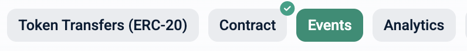
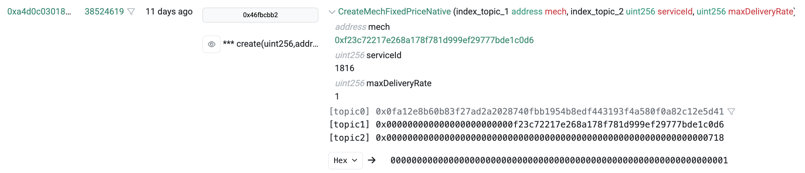

## **Overview** 

This guide contains practical guidelines for interacting with Mechs.
The requester - whether it is an agent or an application - can choose between two methods for sending service requests: 

- On-chain, meaning that the request is sent to the Mech contract (relayed by the [Mech Marketplace](../mech-tool/index.md#appendix-what-is-the-mech-marketplace) for the Mechs which are registered there); 

- Off-chain: the request is sent directly to the Mech service while delivery is sent by the Mech service to the Mech contract (and then relayed by Mech Marketplace contract for Mechs which are registered there); 

In order to send a request, the workflow is the following: 

**1.** Choose a Mech; 

**2.** Make an on-chain deposit according to the Mech’s [payment model](../mech-tool/index.md#overview).

**3.** Choose a method for sending the request;

**4.** Send the request.
		
The detailed instructions to send a request to a Mech can be found below.

### Setup

**Requirements**: [Python](https://www.python.org/) >= 3.10, [Poetry](https://github.com/python-poetry/poetry) == 1.8.4

**1.** Install mech-client: 

```bash
poetry new my_project
cd my_project
poetry add mech-client
poetry install
poetry shell
```

**2.** Setting up an EOA account: 

**a.** Install browser extension of Metamask and open it; 

**b.** Click on the account icon, then on “Add account or hardware wallet”, then “Add a new Ethereum account”, provide a name for the account and then click on “Add account”; 

**c.** Select the newly created account and then click on the top-right menu icon and then “Account details”. You can find the private key by clicking “Show private key”. 

**d.** Copy this key in the file `ethereum_private_key.txt` in your project folder (do not include any leading or trailing spaces, tabs or newlines or any other character); 

**3.** Create an API key for the network you want to use. For instance, follow the steps described [here](https://docs.gnosisscan.io/getting-started/viewing-api-usage-statistics#creating-an-api-key) for Gnosis. Then use the following:

```bash
export MECHX_API_KEY=<api_key>
```

where `<api_key>` is the key just created.

## 1. How to Send a request to a Mech (registered on the Mech MarketPlace)

In order to send a request to a Mech which is registered on the Mech Marketplace, follow the [instructions](#1-2-sending-requests) below, after a [setup](#setup).

In order to send a request to a Mech which receives requests via the Mech Marketplace, follow the instructions below. 
First, [choose a Mech](#1-1-choosing-a-mech). Then choose among the following ways to send a request: via the [terminal](#1-2-in-terminal), using a python [script](#1-3-script-for-automatizing-request-sending), or via the [web interface](#1-4-sending-requests-through-the-web-interface) and follow the instructions within the corresponding section.

### 1. 1. Choosing a Mech

One can find the list of chains on which the Mech Marketplace contracts are deployed [there](https://github.com/valory-xyz/ai-registry-mech/blob/main/docs/configuration.json) (they are the keys of this dictionary).

In order to find the deployed Mechs, choose a network and copy the corresponding MechMarketplace address, and enter it in the scan of the network ([there](https://gnosisscan.io/) for Gnosis for instance).

Click on "Events" as on the following picture.



Each event whose name begins with "CreateMech", as on the following picture (there the name of the event is "CreateMechFixedPriceNative"), corresponds to the creation of a Mech contract. Click on the name of the event, and you can see right below the name of the event the address of the Mech contract which was created. 



Alternatively, for Gnosis network, you can find the list of Mech Marketplace Mechs on this [webpage](https://aimechs.autonolas.network/). Click on "Mech Marketplace" tab as on the following picture.


You will then see the list of available Mech Marketplace Mechs.

In order to find which tools the Mech uses, click on its service id, and then "View code" in the window which opens. Open the folder `mech` and then `service.yaml`. Copy the IPFS hash which follows `agent: valory/mech:0.1.0` and open the corresponding 
file by going to https://gateway.autonolas.tech/ipfs/ with the copied hash at the end of this address. Open the `mech` folder and then the file `aea-config.yaml`. In this file, the keys of the dictionary `tools_to_package_hash` are the
names of the tools that this service uses. 

### 1. 2. In terminal

**1.** Send a request: 
    
- Use the command mechx in terminal, which is structured as follows: 
        
```bash
mechx interact <prompt> --chain-config <chain-config> --use-offchain <bool> --tool <tool> --priority-mech <mech_address>
```

Replace `<prompt>` by a string which corresponds to the request to send to the Mech, and `<chain-config>` by one of the keys in the dictionary found in the file `.mech_client/configs/mechs.json` (for instance "gnosis"). 
Change `<bool>` to True in order to use the off-chain method, and False otherwise. Change `<tool>` to the name of the tool you want to use. Finally, change `<mech_address>` to the address of the Mech you want to send a request to.

- If prompted, add funds to EOA account created above in order to be able to make a deposit on-chain and account for the mech fees. Add native token or OLAS token depending on the payment model of the Mech. It will be indicated how much is needed. You can also find the price per request (resp. the maximal price per Mechs with Nevermined subscription) as follows. 
Enter the address of the Mech in the scan of the network. Click on "Contract", then "Read contract" and find and click on "maxDeliveryRate" in the list which appears below. Divide the displayed number by 10^8 in order to obtain the price per request.

- If prompted to make an on-chain deposit to pay for Mech fees, use the following, if the Mech uses fixed price in native token, where `<network_name>` is replaced with the name of the network (`gnosis` or `base` for instance) and `<amount>` is replaced with the amount to deposit:  

```bash
mechx deposit-native --chain-config <network_name> <amount>
```

In order to be able to send a request, the amount should be larger than the price of the Mech. This price corresponds to the variable MaxDeliveryRate. For other payment models, this is similar. For a fixed price Mech receiving payments in OLAS, use the following (the amount is in ether): 

```bash
mechx deposit-token --chain-config <network_name> <amount>
```

For a Mech using Nevermined subscriptions, use the following (the amount is fixed and allows multiple requests): 

```bash 
mechx purchase-nvm-subscription --chain-config <network_name>
```

In order to select a custom private key file path, you can use the option --key.

**2.** Receive the response: 

- In response to the request, a json file is printed below "Data for agent", in which the key ‘result’ corresponds to the mech’s response to the request. For instance, with the command  

```bash
mechx interact "write a short poem" --tool openai-gpt-3.5-turbo --chain-config gnosis --priority-mech <mech_address>
``` 

you should receive a response as follows: 
        

Note that for some Mechs, a response may take few minutes to come, the websocket connection might be lost. 
In this case, you can use a custom websocket provider (we suggest QuickNode for instance). Once you have a wss url, 
change the following environment variable, replacing `<wss_url>` with yours.

```bash
export MECHX_WSS_ENDPOINT=<wss_url>
```

Otherwise, you can note the request id provided in the logs, convert it to hexadecimal:

```bash
printf "%x\n" <request_id>
```

where `<request_id>` is replaced by the id of your request. Find the Mech on this [page](https://mech.olas.network/mechs) (by searching for its service id or address for instance) and click on its address. You should see the list of requests sent to this Mech. You can find your request using its id (in hexadecimal format). Then click on "Delivers Data" to see the response. 

- Remark: If an "Out of gas" error is encountered, an increase of the gas limit, can solve the problem, using the following line: 

```bash
export MECHX_GAS_LIMIT=200000
```

### 1. 3. Script for automatizing request sending

The following script can be used in order to automatize request sending:

```python
from mech_client.marketplace_interact import marketplace_interact

PRIORITY_MECH_ADDRESS = <priority_mech_address>
PROMPT_TEXT = <prompt_text>
TOOL_NAME = <tool_name>
CHAIN_CONFIG=<network_name>

result = marketplace_interact(
    prompt=PROMPT_TEXT,
    priority_mech=PRIORITY_MECH_ADDRESS,
    use_offchain=USE_OFFCHAIN,
    tool=TOOL_NAME,
    chain_config=CHAIN_CONFIG
)
```

Replace `<priority_mech_address>`, `<prompt_text>`, `<tool_name>` and `<network_name>` respectively with the address of the targeted Mech, the text of the prompt to be sent, the name of the tool and the name of the network. The variable **result** contains the response of the mech. 

### 1. 4. Sending requests through the web interface

**1.** Create a wallet (for instance with [Metamask](https://metamask.io/)) and connect it to the web interface by clicking on the button “Connect wallet” on the webpage. This wallet must be provided with xDAI in order to pay the Mechs for the requests.

**2.** Go to the webpage [here](https://mech.olas.network/gnosis/mechs). Click on the address of the Mech you want to send a request to.

**4.** Click on "New Request". The following pop-up will appear: 


**5.** Enter a prompt and select the tool, then click on "Request". 

**6.** A window like the one as follows will appear: 

Click on "Confirm".

**7.** You can find the request by searching for your wallet's address in the column "Sender". When the request is delivered, you can access the delivered data in the column "Delivers data" in the corresponding row.

## 2. Sending requests to legacy Mechs

It is also possible to send requests to Mechs which were deployed before the Mech Marketplace (we call these _legacy Mechs_). 
This section describes how to do this.

Follow first the steps in the [setup](#setup) above, then [choose a Mech](#2-1-choosing-a-mech). After this, there are three possible ways to send a request to a legacy Mech: in [terminal](#2-2-in-terminal), via a python [script](#2-3-script-for-automatizing-request-sending) or via the [web interface](#2-4-sending-requests-through-the-web-interface).

### 2. 1. Choosing a Mech

- A list of chains on which legacy Mechs are deployed and the Mech contracts addresses can be found [here](https://github.com/valory-xyz/mech?tab=readme-ov-file#examples-of-deployed-mechs). They are also displayed on the picture below. Choose the chain and the Mech (column "Mech Instance (Fixed Pricing)" and not "Mech Instance (Nevermined)"), and note its id;  


For Gnosis, more legacy Mechs are listed on this [webpage](https://aimechs.autonolas.network/). Click on "Legacy" tab as on the following picture.


You will see the list of Legacy Mechs available.

- Add funds corresponding to the network of the Mech (column “Network” of the table) in the EOA account created above, in order to pay the mech for requests. The price per request can be found as follows. Find the contract of the Mech. For instance, [here](https://gnosisscan.io/address/0x77af31De935740567Cf4fF1986D04B2c964A786a#readContract) is the contract for a Mech on Gnosis chain. Click on "Contract", then "Read contract" and find and click on "price" in the list which appears below. Divide the displayed number by 10^8 in order to obtain the price per request (here 0.01 xDAI).

### 2. 2. In terminal

**1.** Send a request: 
    
- Use the command mechx in terminal, which is structured as follows: 
        
```bash
mechx interact <prompt> --agent_id <agent_id>
```

Replace `<agent_id>` with the following: the number (as an integer, not string) after the character “-” in the column “Mech Instance (Fixed Pricing) - Agent Id” of the table [here](https://github.com/valory-xyz/mech?tab=readme-ov-file#examples-of-deployed-mechs) for the chosen mech; Replace `<prompt>` by a string which corresponds to the request to send to the Mech. 

- The list of ids and the names of the tools that the Mech can use will appear. You will be prompted to enter the id of a tool that the Mech will use to respond to the request.

- In order to select a tool, you can use the following to see which tools are used by which agents: 

```bash
mechx tools-for-agents
```

You can identify which tools are used by a Mech by looking at the "Agent ID" column. Using the unique identifier of the tool, you can find a description of the tool, using the following: 

```bash
mechx tool-description <unique_identifier> --chain-config <chain_config>
```

where `<unique_identifier>` is replaced by the unique id of the tool and `<chain_config>` by the name of the network.

**2.** Receive the response: 

- In response to the request, a json file is printed below "Data for agent", in which the key ‘result’ corresponds to the mech’s response to the request. For instance, with the command  

```bash
mechx interact "write a short poem" --agent_id 6
``` 

and after selecting `openai-gpt-3.5-turbo` for the tool, you will receive a response as follows: 
        

- Remark: If an "Out of gas" error is encountered, an increase of the gas limit, can solve the problem, using the following line: 

```bash
export MECHX_GAS_LIMIT=200000
```

### 2. 3. Script for automatizing request sending

The following script can be used in order to automatize request sending:

```python
from mech_client.interact import interact

PROMPT_TEXT = 'Will Gnosis pay reach 100k cards in 2024?'
AGENT_ID = 6
TOOL_NAME = "prediction-online"

result = interact(
    prompt=PROMPT_TEXT,
    agent_id=AGENT_ID,
    tool=TOOL_NAME
)
```

The variables **PROMPT_TEXT**, **AGENT_ID** and **TOOL_NAME** can be changed. The variable **result** contains the response of the mech. 

### 2. 4. Sending requests through the web interface

**1.** Create a wallet (for instance with [Metamask](https://metamask.io/)) and connect it to the web interface by clicking on the button “Connect wallet” on the webpage. This wallet must be provided with xDAI in order to pay the Mechs for the requests.

**2.** Go to the webpage [here](https://mech.olas.network/gnosis/mechs?legacy=true). Click on the address of the Mech you want to send a request to.

**4.** Click on "New Request". The following pop-up will appear: 


**5.** Enter a prompt and select the tool, then click on "Request". 

**6.** A window like the one as follows will appear: 

Click on "Confirm".

**7.** You can find the request by searching for your wallet's address in the column "Sender". When the request is delivered, you can access the delivered data in the column "Delivers data" in the corresponding row.