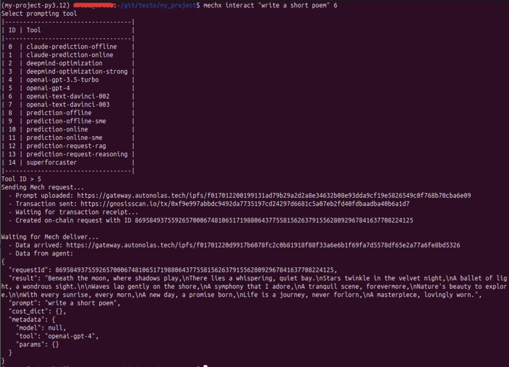
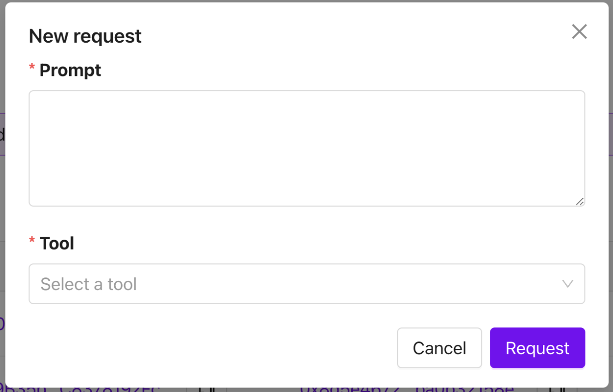
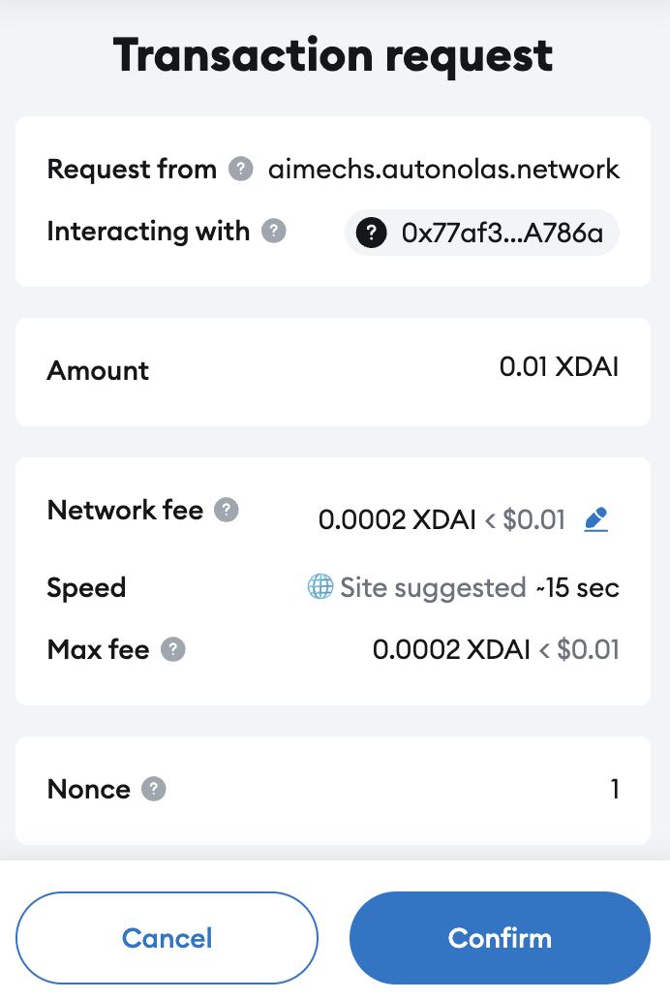
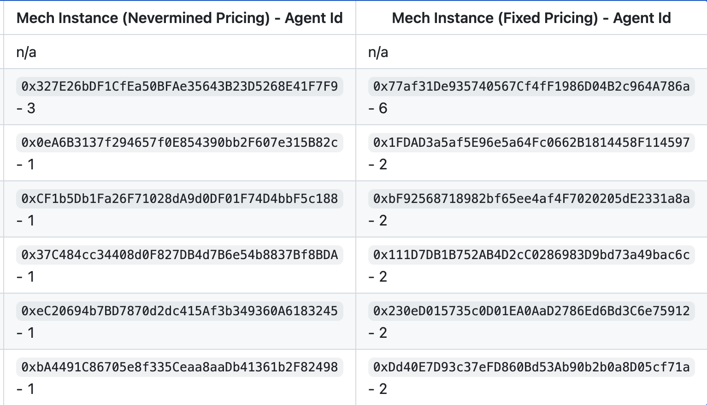
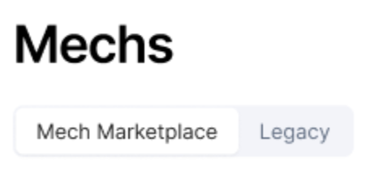

## **Overview**

This guide contains practical guidelines for interacting with Mechs.
A requester - whether it is an agent or an application - can choose between two methods for sending service requests:

- On-chain: The request is sent to the Mech contract. For Mechs registered on the [Mech Marketplace](../mech-tools-dev/index.md#appendix-what-is-the-mech-marketplace), it is relayed via the Mech Marketplace.

- Off-chain: The request is sent directly to the Mech service. The Mech then sends the result (or delivery) to the Mech contract, which is subsequently relayed by the Mech Marketplace if the Mech is registered there.

To send a request, follow these steps:

**1.** Choose a Mech;

**2.** Make an on-chain deposit according to the Mech’s [payment model](../mech-tools-dev/index.md#overview).

**3.** Choose a method for sending the request (on-chain or off-chain).

**4.** Send the request.

Detailed instructions for each step are provided below.

## Setup

**Requirements**: [Python](https://www.python.org/) >= 3.10, [Poetry](https://github.com/python-poetry/poetry) == 1.8.4

**1.** Install mech-client:

```bash
pip install mech-client
```

**2.** Setting up an EOA ([Externally Owned Account](https://ethereum.org/en/developers/docs/accounts/)) account:

**a.** Install browser extension of Metamask and open it.

**b.** Click on the account icon, then select “Add account or hardware wallet”, then “Add a new Ethereum account”. Provide a name for the account and click “Add account”.

**c.** Select the newly created account. Open the top-right menu, click “Account details”, then click “Show private key”.

**d.** Copy this key in the file `ethereum_private_key.txt` in your project folder. Make sure the file contains only the private key, with no leading or trailing spaces, tabs, or newlines.

## 1. How to Send a request to a Mech (registered on the Mech MarketPlace)

To send a request to a Mech that is accessible through the Mech Marketplace, first complete the [setup](#setup), then follow the [instructions](#1-2-sending-requests) below.

You will need to [choose a Mech](#1-1-choosing-a-mech), and then select one of the following methods to send a request:
- Via the [terminal](#1-2-in-terminal),
- Using a Python [script](#1-3-script-for-automatizing-request-sending),
- Or through the [web interface](#1-4-sending-requests-through-the-web-interface).

Follow the instructions in the corresponding section.


### 1. 1. Choosing a Mech

- Use the command mechx in terminal, which is structured as follows. 
```bash
mechx fetch-mm-mechs-info --chain-config <chain-config>

Replace `<chain-config>` by the chosen network. Currently supported chains are gnosis and base.
```
```bash
+--------------+--------------------+--------------------------------------------+--------------------+---------------------------------------------------------------------------------------------------------------+
|   Service Id | Mech Type          | Mech Address                               |   Total Deliveries | Metadata Link                                                                                                 |
+==============+====================+============================================+====================+===============================================================================================================+
|         2182 | Fixed Price Native | 0xc05e7412439bd7e91730a6880e18d5d5873f632c |              41246 | https://gateway.autonolas.tech/ipfs/f01701220157d3b106831e2713b86af1b52af76a3ef28c52ae0853e9638180902ebee41d4 |
+--------------+--------------------+--------------------------------------------+--------------------+---------------------------------------------------------------------------------------------------------------+
|         2235 | Fixed Price Native | 0xb3c6319962484602b00d5587e965946890b82101 |              10127 | https://gateway.autonolas.tech/ipfs/f01701220157d3b106831e2713b86af1b52af76a3ef28c52ae0853e9638180902ebee41d4 |
+--------------+--------------------+--------------------------------------------+--------------------+---------------------------------------------------------------------------------------------------------------+
|         2198 | Fixed Price Native | 0x601024e27f1c67b28209e24272ced8a31fc8151f |               5714 | https://gateway.autonolas.tech/ipfs/f01701220157d3b106831e2713b86af1b52af76a3ef28c52ae0853e9638180902ebee41d4 |
+--------------+--------------------+--------------------------------------------+--------------------+---------------------------------------------------------------------------------------------------------------+
|         1722 | Fixed Price Token  | 0x13f36b1a516290b7563b1de574a02ebeb48926a1 |                399 | https://gateway.autonolas.tech/ipfs/f01701220157d3b106831e2713b86af1b52af76a3ef28c52ae0853e9638180902ebee41d4 |
+--------------+--------------------+--------------------------------------------+--------------------+---------------------------------------------------------------------------------------------------------------+
|         2135 | Fixed Price Native | 0xbead38e4c4777341bb3fd44e8cd4d1ba1a7ad9d7 |                353 | https://gateway.autonolas.tech/ipfs/f01701220157d3b106831e2713b86af1b52af76a3ef28c52ae0853e9638180902ebee41d4 |
+--------------+--------------------+--------------------------------------------+--------------------+---------------------------------------------------------------------------------------------------------------+
```


### 1. 2. In terminal

### 1. 2. 1. Request command

- Use the command mechx in terminal, which is structured as follows:

```bash
mechx interact <prompt> --chain-config <chain-config> --use-offchain <bool> --tool <tool> --priority-mech <mech_address>
```

Replace each placeholder as follows:

- `<prompt>`: The request description to be sent to the Mech. For instance: "Write a short poem".

- `<chain-config>`: One of the keys in the dictionary defined in `.mech_client/configs/mechs.json` (e.g., "gnosis"). This provides the client with a configuration for the chosen network.

- `<bool>`: True to use the off-chain method; False for on-chain.

- `<tool>`: The name of the tool to use.

- `<mech_address>`: The address of the Mech to send the request to.

### 1. 2. 2. Deposits

When you send a request, you may be prompted to add funds to your EOA account to cover on-chain deposits and Mech service fees. The required token (either native token or OLAS) depends on the Mech's payment model. The exact amount will be indicated at runtime.

**Finding the price per request**

To determine the Mech's fee in advance:

- Enter the Mech's address into the block explorer of the corresponding network.

- Click on "Contract", then "Read Contract".

- Find and click on the function maxDeliveryRate.

- Divide the displayed number by 10^8 in order to obtain the price per request (in ether or token units, depending on the Mech).

Note: For Mechs using the Nevermined subscription model, this value corresponds to the maximum price per request; actual usage may involve multiple requests per subscription.

**Making a deposit**

- For fixed-price Mechs using native tokens:

```bash
mechx deposit-native --chain-config <network_name> <amount>
```

- For fixed-price Mechs using OLAS tokens (amount in ether):

```bash
mechx deposit-token --chain-config <network_name> <amount>
```

In both cases above, `<amount>` must be at least the Mech's price (as given by maxDeliveryRate).

- For Mechs using Nevermined subscriptions:

```bash
mechx purchase-nvm-subscription --chain-config <network_name>
```

This command purchases a fixed-price subscription that enables multiple requests.

Note: In order to select a custom private key file path, you can use the option --key.

### 1. 2. 2. Finding the response

After sending a request, a JSON response will appear below the line `"Data for agent"`. The key `"result"` in this JSON object contains the Mech's response to your request.

For example, the following command:

```bash
mechx interact "write a short poem" --tool openai-gpt-3.5-turbo --chain-config gnosis --priority-mech <mech_address>
```

you should receive a response as follows:
        

**Troubleshooting: websocket connection lost**

For some Mechs, the response may take a few minutes to arrive. During that time, the WebSocket connection might be lost. To avoid this, you can configure a custom WebSocket provider (we suggest QuickNode as an example). Once you have your WebSocket URL, set the following environment variable:

```bash
export MECHX_WSS_ENDPOINT=<wss_url>
```

Alternatively, if the connection is lost, you can retrieve the response manually. To do this:

- Note the `request_id` printed in the logs.

- Convert the request ID to hexadecimal:

```bash
printf "%x\n" <request_id>
```

- Go to the [Mech list](https://mech.olas.network/mechs) and locate your Mech (by its service ID or address).

- Click on the Mech’s address to see a list of requests it has received.

- Find your request by matching the hexadecimal request ID.

- Click on "Delivers Data" to view the response.

**Troubleshooting: non-hexadecimal symbol**

You may encounter an error indicating that the private key contains invalid (non-hexadecimal) characters.
This can happen, in particular, on Windows systems, where some IDEs may automatically add a newline character (`\n`) at the end of a file—for example, in `ethereum_private_key.txt`.

To avoid this, check your IDE settings and ensure that the file contains only the private key with no trailing newline or whitespace.

**Troubleshooting: out of gas**

If an "Out of gas" error is encountered, an increase of the gas limit can solve the problem. To do this:

```bash
export MECHX_GAS_LIMIT=200000
```

### 1. 3. Script for automatizing request sending

The following script can be used in order to automatize request sending:

```python
from mech_client.marketplace_interact import marketplace_interact

PRIORITY_MECH_ADDRESS = "<priority_mech_address>"
PROMPT_TEXT = "<prompt_text>"
TOOL_NAME = "<tool_name>"
CHAIN_CONFIG = "<network_name>"
USE_OFFCHAIN = False

result = marketplace_interact(
    prompt=PROMPT_TEXT,
    priority_mech=PRIORITY_MECH_ADDRESS,
    use_offchain=USE_OFFCHAIN,
    tool=TOOL_NAME,
    chain_config=CHAIN_CONFIG
)
```

Replace the placeholders as follows:

- `<priority_mech_address>`: the address of the targeted Mech,

- `<prompt_text>`: the text of the prompt to send,

- `<tool_name>`: the name of the tool to use,

- `<network_name>`: the name of the target network (e.g., "gnosis", "base").

- `USE_OFFCHAIN`: set to True to use off-chain request delivery, or leave to False for on-chain.

The variable **result** contains the response of the mech.

### 1. 4. Sending requests through the web interface

**1.** Create a wallet (e.g., using [MetaMask](https://metamask.io/)) and connect it to the [web interface](https://mech.olas.network/gnosis/mechs) by clicking the **“Connect wallet”** button at the top of the page.
The wallet must have some xDAI to pay for requests.

**2.** On the [web interface](https://mech.olas.network/gnosis/mechs), click on the address of the Mech you want to interact with.

**3.** Click on **"New Request"**. A pop-up window will appear:



**4.** Enter your prompt and select the tool to use, then click **"Request"**.

**5.** A confirmation window will appear, like the one below:



Click **"Confirm"** to send the request.

**6.** After submission, you can track your request by searching for your wallet address in the **"Sender"** column.

Once the request is fulfilled, a **"Delivers Data"** link will appear in the same row under the **"Delivers data"** column. Click it to view the Mech’s response.

## 2. Sending requests to legacy Mechs

You can also send requests to Mechs that were deployed before the introduction of the Mech Marketplace. We refer to these as _legacy Mechs_. This section explains how to interact with them.

First, complete the steps in the [setup](#setup) section, then [choose a Mech](#2-1-choosing-a-mech).
After that, there are three ways to send a request to a legacy Mech: via the [terminal](#2-2-in-terminal), using a Python [script](#2-3-script-for-automatizing-request-sending), or through the [web interface](#2-4-sending-requests-through-the-web-interface).

### 2. 1. Choosing a Mech

- A list of chains where legacy Mechs are deployed, along with their contract addresses, can be found [here](https://github.com/valory-xyz/mech?tab=readme-ov-file#examples-of-deployed-mechs).
  The relevant section is also shown in the image below.

  **Important**: Choose a Mech from the **"Mech Instance (Fixed Pricing)"** column, **not** the "Mech Instance (Nevermined)" column.
  Then, note the **agent ID** (the number following the dash `-` in the agent identifier).

  

- For the Gnosis network, additional legacy Mechs are listed on [this webpage](https://mech.olas.network/). Click the **"Legacy"** tab, as shown below:

  

  You will then see the list of available legacy Mechs.

Once you have selected a Mech:

- Fund your EOA account (created during [setup](#setup)) with the appropriate token for the Mech’s network. Refer to the **"Network"** column in the deployment table to determine which token to use.

**Finding the Mech’s price per request**

1. Open the Mech’s contract in the block explorer of its network.
   For example, [this contract](https://gnosisscan.io/address/0x77af31De935740567Cf4fF1986D04B2c964A786a#readContract) is for a Mech on the Gnosis chain.

2. Click on **“Contract”**, then **“Read Contract”**.

3. Scroll down to find the `price` function and click on it.

4. The result is given as an integer. Divide the value by \(10^8\) to obtain the price per request in the native token.
   (In the example above, this gives 0.01 xDAI.)

### 2. 2. In terminal

**1.** Send a request:

- Use the command mechx in terminal, which is structured as follows:

```bash
mechx interact <prompt> --agent_id <agent_id>
```

Replace the placeholders as follows: `<agent_id>`: the number (as an integer, not string) after the character “-” in the column “Mech Instance (Fixed Pricing) - Agent Id” of the table [here](https://github.com/valory-xyz/mech?tab=readme-ov-file#examples-of-deployed-mechs) for the chosen mech; `<prompt>`: string which corresponds to the request to send to the Mech.

- The list of ids and the names of the tools that the Mech can use will appear. You will be prompted to enter the id of a tool that the Mech will use to respond to the request.

- In order to select a tool, you can use the following to see which tools are used by which agents:

```bash
mechx tools-for-agents
```

You can identify which tools are used by a Mech by looking at the "Agent ID" column. Using the unique identifier of the tool, you can find a description of the tool, using the following:

```bash
mechx tool-description <unique_identifier> --chain-config <chain_config>
```

where `<unique_identifier>` is replaced by the unique id of the tool and `<chain_config>` by the name of the network.

**2.** Receive the response:

- In response to the request, a JSON file is printed below "Data for agent". In this JSON file, the key ‘result’ corresponds to the mech’s response to the request. For instance, with the command

```bash
mechx interact "write a short poem" --agent_id 6
```

and after selecting `openai-gpt-3.5-turbo` for the tool, you will receive a response as follows:
        

- Remark: If an "Out of gas" error is encountered, an increase of the gas limit, can solve the problem, using the following line:

```bash
export MECHX_GAS_LIMIT=200000
```

### 2. 3. Script for automatizing request sending

The following script can be used in order to automatize request sending:

```python
from mech_client.interact import interact

PROMPT_TEXT = 'Will Gnosis pay reach 100k cards in 2024?'
AGENT_ID = 6
TOOL_NAME = "prediction-online"

result = interact(
    prompt=PROMPT_TEXT,
    agent_id=AGENT_ID,
    tool=TOOL_NAME
)
```

The variables **PROMPT_TEXT**, **AGENT_ID** and **TOOL_NAME** can be changed. The variable **result** contains the response of the mech.

### 2. 4. Sending requests through the web interface

**1.** Create a wallet (for instance with [Metamask](https://metamask.io/)) and connect it to the web interface by clicking on the button “Connect wallet” on the webpage. This wallet must be provided with xDAI in order to pay the Mechs for the requests.

**2.** Go to the webpage [here](https://mech.olas.network/gnosis/mechs?legacy=true). Click on the address of the Mech you want to send a request to.

**4.** Click on "New Request". The following pop-up will appear:


**5.** Enter a prompt and select the tool, then click on "Request".

**6.** A window like the one as follows will appear:

Click on "Confirm".

**7.** You can find the request by searching for your wallet's address in the column "Sender". When the request is delivered, you can access the delivered data in the column "Delivers data" in the corresponding row.